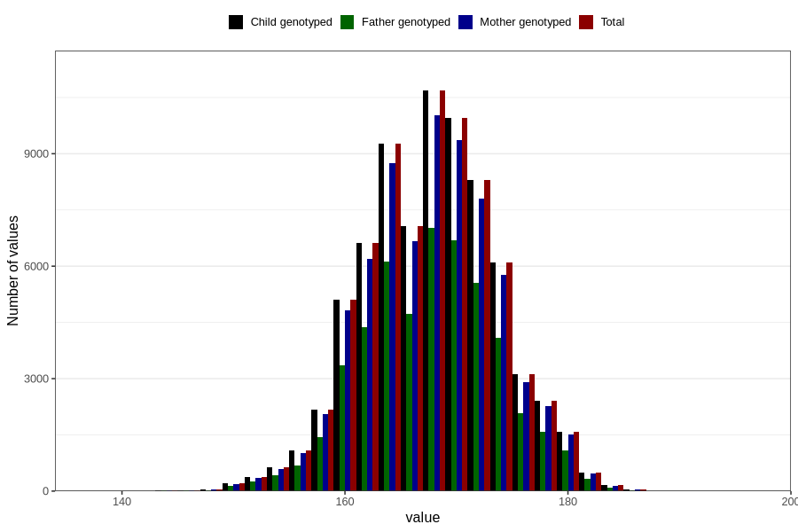

# mother_height_self
Variable mapping to `AA87` in `Skjema1_v12`.
- Number of values:

| Value | Total | Child genotyped | Mother genotyped | Father genotyped |
| ----- | ----- | --------------- | ---------------- | ---------------- |
| Missing | 5347 | 5347 | 4992 | 3035 |
| Non-missing | 75459 | 75459 | 71032 | 50128 |
| 25th percentile | 164 | 164 | 164 | 164 |
| 50th percentile | 168 | 168 | 168 | 168 |
| 75th percentile | 172 | 172 | 172 | 172 |
| Mean | 168.182628977325 | 168.182628977325 | 168.184592859556 | 168.225961538462 |
| Standard deviation | 5.88890382762496 | 5.88890382762496 | 5.89152841919263 | 5.87695012522906 |
| N | 75459 | 75459 | 71032 | 50128 |

