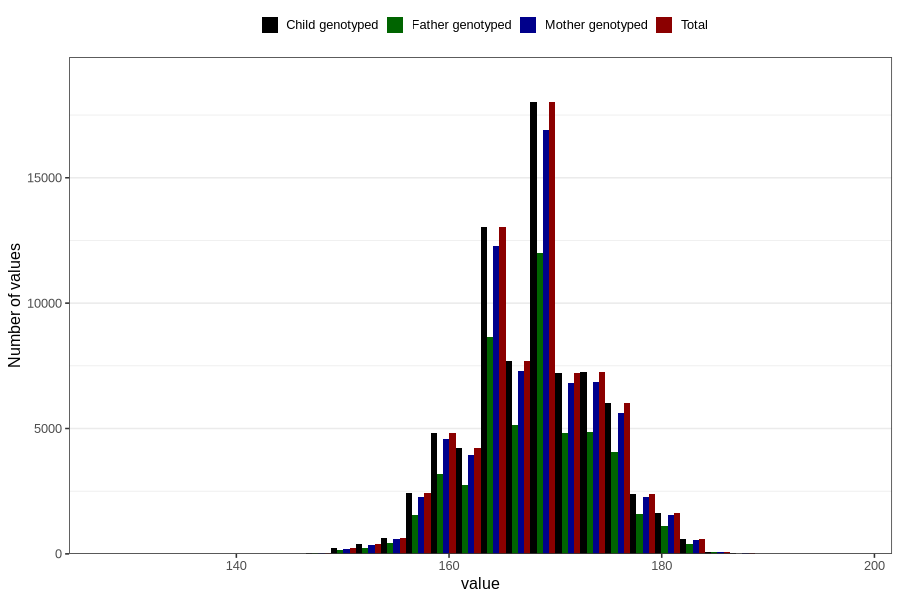

# mother_median_height
Variable created during phenotype curation.
- Number of values:

| Value | Total | Child genotyped | Mother genotyped | Father genotyped |
| ----- | ----- | --------------- | ---------------- | ---------------- |
| Missing | 4079 | 4079 | 3798 | 2179 |
| Non-missing | 76727 | 76727 | 72226 | 50984 |
| 25th percentile | 164 | 164 | 164 | 164 |
| 50th percentile | 168 | 168 | 168 | 168 |
| 75th percentile | 172 | 172 | 172 | 172 |
| Mean | 168.174971001082 | 168.174971001082 | 168.177588403068 | 168.218235132591 |
| Standard deviation | 5.87675693858401 | 5.87675693858401 | 5.87977085091181 | 5.86102034432862 |
| N | 76727 | 76727 | 72226 | 50984 |

