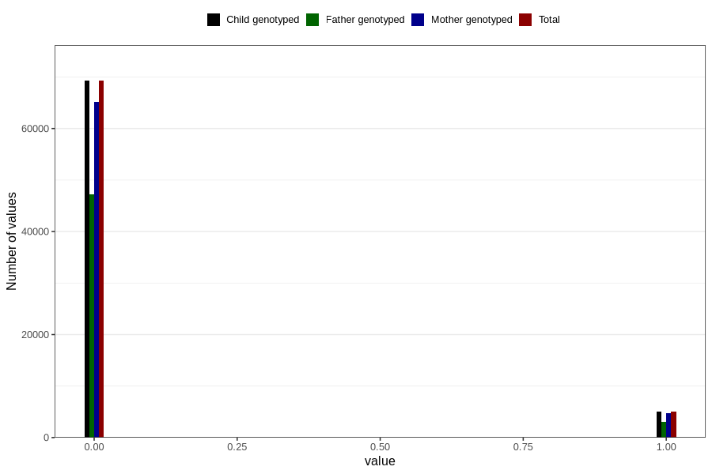

# mother_tongue_farfar
Variable mapping to `AA1313_D` in `Skjema1_v12`.
- Number of values:

| Value | Total | Child genotyped | Mother genotyped | Father genotyped |
| ----- | ----- | --------------- | ---------------- | ---------------- |
| Missing | 6495 | 6495 | 6119 | 2892 |
| Non-missing | 74311 | 74311 | 69905 | 50271 |
| 0 | 69269 | 69269 | 65158 | 47205 |
| 1 | 5042 | 5042 | 4747 | 3066 |

