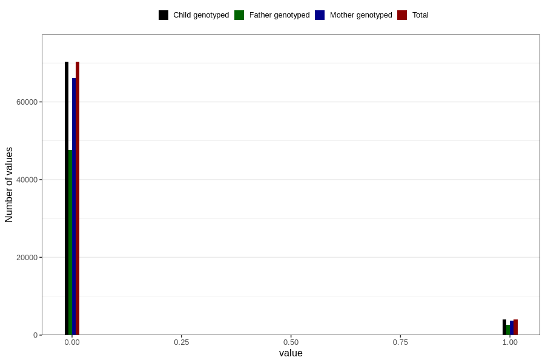

# mother_tongue_mother
Variable mapping to `AA1306_D` in `Skjema1_v12`.
- Number of values:

| Value | Total | Child genotyped | Mother genotyped | Father genotyped |
| ----- | ----- | --------------- | ---------------- | ---------------- |
| Missing | 6495 | 6495 | 6119 | 2892 |
| Non-missing | 74311 | 74311 | 69905 | 50271 |
| 0 | 70294 | 70294 | 66140 | 47645 |
| 1 | 4017 | 4017 | 3765 | 2626 |

