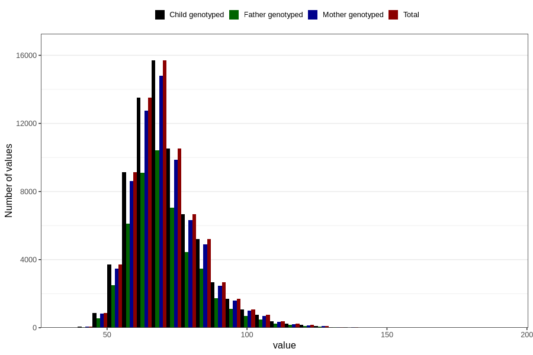

# mother_weight_15w
Variable mapping to `AA86` in `Skjema1_v12`.
- Number of values:

| Value | Total | Child genotyped | Mother genotyped | Father genotyped |
| ----- | ----- | --------------- | ---------------- | ---------------- |
| Missing | 8310 | 8310 | 7792 | 4963 |
| Non-missing | 72496 | 72496 | 68232 | 48200 |
| 25th percentile | 62 | 62 | 62 | 62 |
| 50th percentile | 69 | 69 | 69 | 69 |
| 75th percentile | 77 | 77 | 77 | 77 |
| Mean | 70.9041602295299 | 70.9041602295299 | 70.8823572517294 | 70.8078838174274 |
| Standard deviation | 12.4869972265075 | 12.4869972265075 | 12.4512189884675 | 12.3789242002307 |
| N | 72496 | 72496 | 68232 | 48200 |

