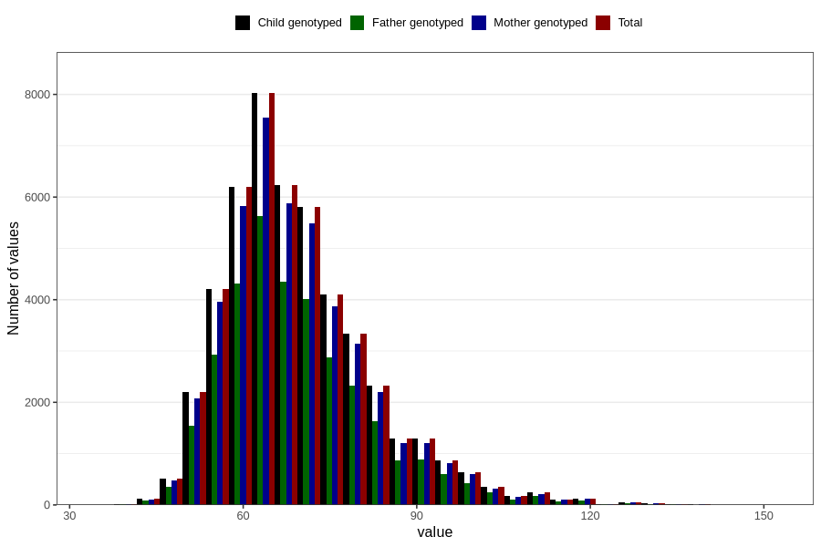

# mother_weight_18m
Variable mapping to `EE924` in `Skjema5_18mnd_v12`.
- Number of values:

| Value | Total | Child genotyped | Mother genotyped | Father genotyped |
| ----- | ----- | --------------- | ---------------- | ---------------- |
| Missing | 32444 | 32444 | 30521 | 19547 |
| Non-missing | 48362 | 48362 | 45503 | 33616 |
| 25th percentile | 60.5 | 60.5 | 60.5 | 60.5 |
| 50th percentile | 67 | 67 | 67 | 67 |
| 75th percentile | 76 | 76 | 76 | 76 |
| Mean | 69.6165770646375 | 69.6165770646375 | 69.5843944355317 | 69.5273768443598 |
| Standard deviation | 12.9143479973762 | 12.9143479973762 | 12.8572578129564 | 12.7836746710715 |
| N | 48362 | 48362 | 45503 | 33616 |

