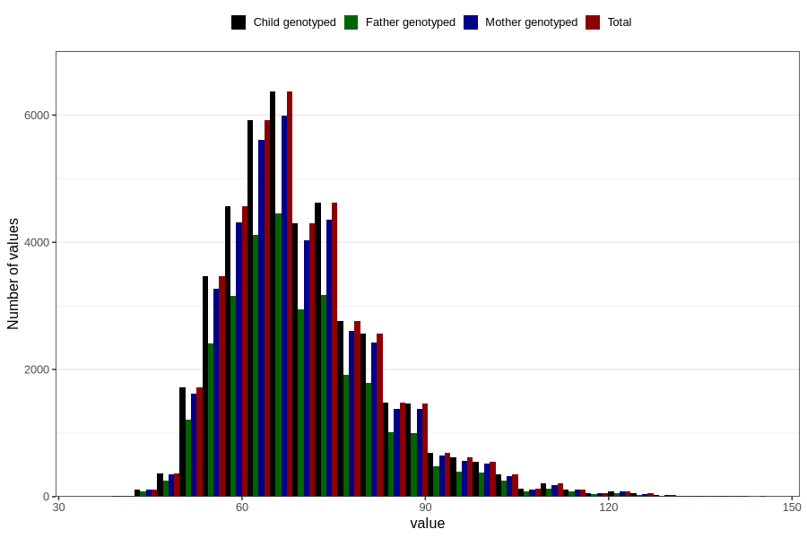

# mother_weight_3y
Variable mapping to `GG501` in `Skjema6_3aar_v12`.
- Number of values:

| Value | Total | Child genotyped | Mother genotyped | Father genotyped |
| ----- | ----- | --------------- | ---------------- | ---------------- |
| Missing | 38139 | 38139 | 35885 | 23672 |
| Non-missing | 42667 | 42667 | 40139 | 29491 |
| 25th percentile | 61 | 61 | 61 | 61 |
| 50th percentile | 68 | 68 | 68 | 68 |
| 75th percentile | 76 | 76 | 76 | 76 |
| Mean | 69.9440949680081 | 69.9440949680081 | 69.9022770871222 | 69.8435624427792 |
| Standard deviation | 12.853081805363 | 12.853081805363 | 12.8136268920673 | 12.7405016386749 |
| N | 42667 | 42667 | 40139 | 29491 |

