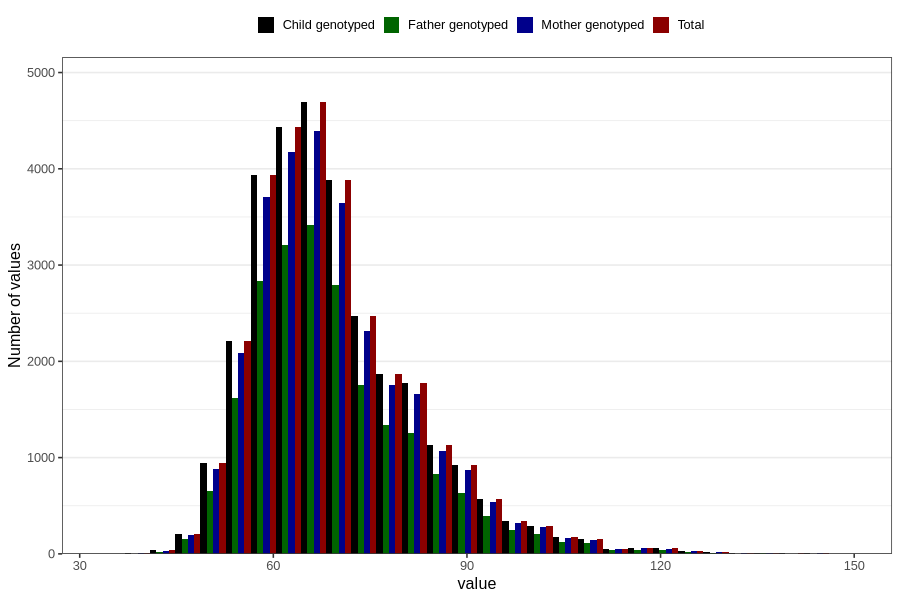

# mother_weight_5y
Variable mapping to `LL339` in `Skjema5aar_v12`.
- Number of values:

| Value | Total | Child genotyped | Mother genotyped | Father genotyped |
| ----- | ----- | --------------- | ---------------- | ---------------- |
| Missing | 50501 | 50501 | 47555 | 31415 |
| Non-missing | 30305 | 30305 | 28469 | 21748 |
| 25th percentile | 61 | 61 | 61 | 61 |
| 50th percentile | 67 | 67 | 67 | 67 |
| 75th percentile | 75.5 | 75.5 | 75.4 | 75 |
| Mean | 69.5285728427652 | 69.5285728427652 | 69.5061891882398 | 69.4084283612286 |
| Standard deviation | 12.5936429945662 | 12.5936429945662 | 12.5700813989871 | 12.4385813952622 |
| N | 30305 | 30305 | 28469 | 21748 |

