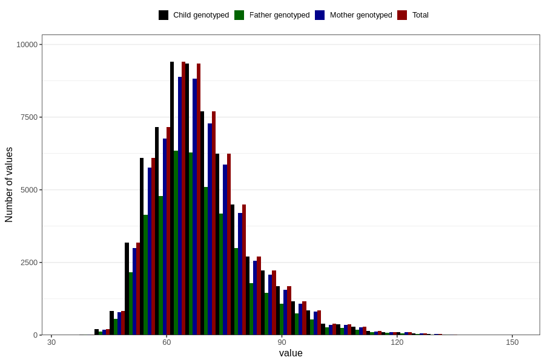

# mother_weight_6m
Variable mapping to `DD673` in `Skjema4_6mnd_v12`.
- Number of values:

| Value | Total | Child genotyped | Mother genotyped | Father genotyped |
| ----- | ----- | --------------- | ---------------- | ---------------- |
| Missing | 15979 | 15979 | 14924 | 9875 |
| Non-missing | 64827 | 64827 | 61100 | 43288 |
| 25th percentile | 60 | 60 | 60 | 60 |
| 50th percentile | 67 | 67 | 67 | 67 |
| 75th percentile | 75 | 75 | 75 | 75 |
| Mean | 69.0474478226665 | 69.0474478226665 | 69.0025417348609 | 68.9463454075032 |
| Standard deviation | 12.7775179781164 | 12.7775179781164 | 12.7322509722239 | 12.733504104452 |
| N | 64827 | 64827 | 61100 | 43288 |

