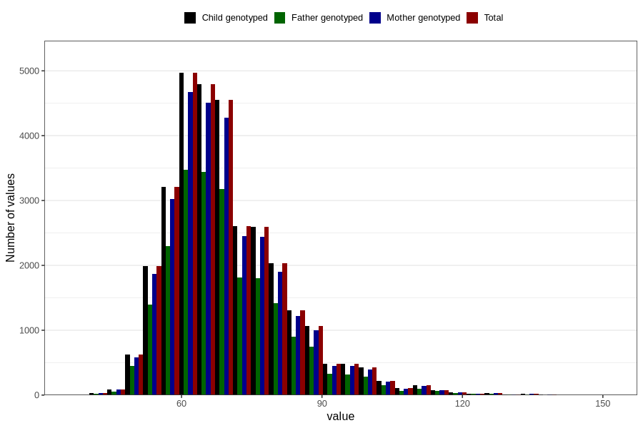

# mother_weight_8y
Variable mapping to `NN284` in `Skjema8aar_v12`.
- Number of values:

| Value | Total | Child genotyped | Mother genotyped | Father genotyped |
| ----- | ----- | --------------- | ---------------- | ---------------- |
| Missing | 48843 | 48843 | 46016 | 30754 |
| Non-missing | 31963 | 31963 | 30008 | 22409 |
| 25th percentile | 61 | 61 | 61 | 61 |
| 50th percentile | 68 | 68 | 68 | 67.5 |
| 75th percentile | 76 | 76 | 76 | 75.2 |
| Mean | 69.7832712824203 | 69.7832712824203 | 69.7482371367635 | 69.6295506269802 |
| Standard deviation | 12.576923122048 | 12.576923122048 | 12.5456749108099 | 12.4539576022887 |
| N | 31963 | 31963 | 30008 | 22409 |

