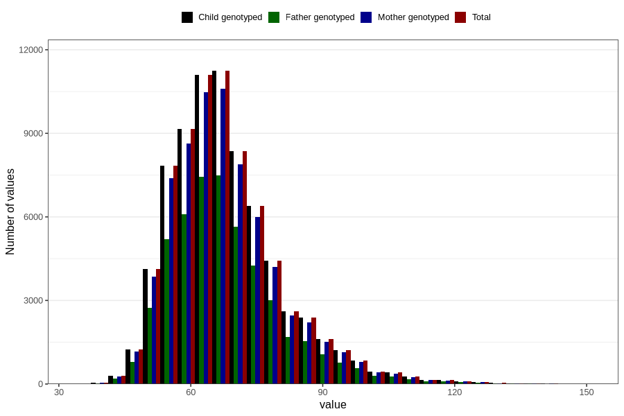

# mother_weight_beginning_self
Variable mapping to `AA85` in `Skjema1_v12`.
- Number of values:

| Value | Total | Child genotyped | Mother genotyped | Father genotyped |
| ----- | ----- | --------------- | ---------------- | ---------------- |
| Missing | 6199 | 6199 | 5799 | 3565 |
| Non-missing | 74607 | 74607 | 70225 | 49598 |
| 25th percentile | 59 | 59 | 59 | 60 |
| 50th percentile | 65 | 65 | 65 | 65 |
| 75th percentile | 74 | 74 | 74 | 74 |
| Mean | 67.9941828514751 | 67.9941828514751 | 67.9704948380206 | 67.960925843784 |
| Standard deviation | 12.7049319040357 | 12.7049319040357 | 12.6626841577958 | 12.6133374455262 |
| N | 74607 | 74607 | 70225 | 49598 |

