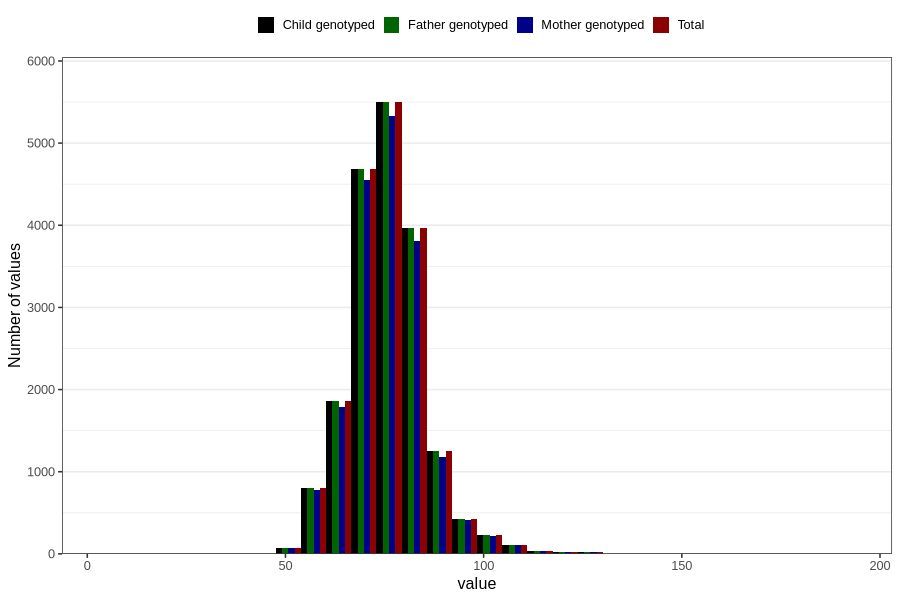

# weight_age_18_father15
Variable mapping to `G__7_1` in `Far2_V12`.
- Number of values:

| Value | Total | Child genotyped | Mother genotyped | Father genotyped |
| ----- | ----- | --------------- | ---------------- | ---------------- |
| Missing | 61792 | 61792 | 57678 | 34149 |
| Non-missing | 19014 | 19014 | 18346 | 19014 |
| 25th percentile | 70 | 70 | 70 | 70 |
| 50th percentile | 75 | 75 | 75 | 75 |
| 75th percentile | 80 | 80 | 80 | 80 |
| Mean | 75.6103397496582 | 75.6103397496582 | 75.5927177586395 | 75.6103397496582 |
| Standard deviation | 9.71632028509046 | 9.71632028509046 | 9.70003859886321 | 9.71632028509046 |
| N | 19014 | 19014 | 18346 | 19014 |

