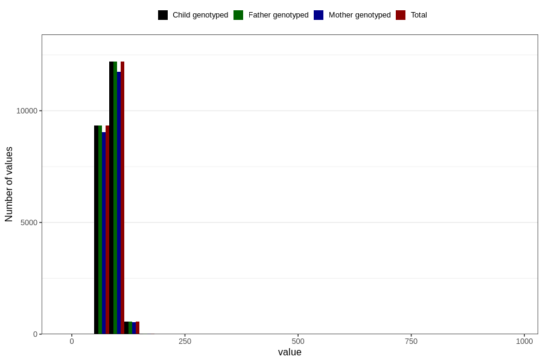

# weight_father15
Variable mapping to `G__6` in `Far2_V12`.
- Number of values:

| Value | Total | Child genotyped | Mother genotyped | Father genotyped |
| ----- | ----- | --------------- | ---------------- | ---------------- |
| Missing | 58698 | 58698 | 54704 | 31055 |
| Non-missing | 22108 | 22108 | 21320 | 22108 |
| 25th percentile | 79 | 79 | 79 | 79 |
| 50th percentile | 85 | 85 | 85 | 85 |
| 75th percentile | 95 | 95 | 95 | 95 |
| Mean | 87.3191152523973 | 87.3191152523973 | 87.2776735459662 | 87.3191152523973 |
| Standard deviation | 14.132942585609 | 14.132942585609 | 14.1414161479248 | 14.132942585609 |
| N | 22108 | 22108 | 21320 | 22108 |

