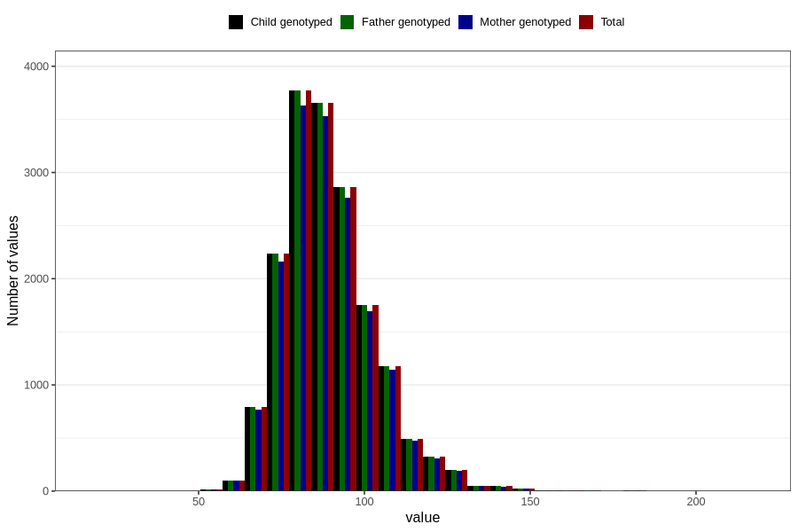

# weight_hf
Variable mapping to `HF128` in `HelseFedre`.
- Number of values:

| Value | Total | Child genotyped | Mother genotyped | Father genotyped |
| ----- | ----- | --------------- | ---------------- | ---------------- |
| Missing | 63276 | 63276 | 59113 | 35633 |
| Non-missing | 17530 | 17530 | 16911 | 17530 |
| 25th percentile | 80 | 80 | 80 | 80 |
| 50th percentile | 88 | 88 | 88 | 88 |
| 75th percentile | 96 | 96 | 96 | 96 |
| Mean | 89.4089560752995 | 89.4089560752995 | 89.3842469398616 | 89.4089560752995 |
| Standard deviation | 13.9133632070548 | 13.9133632070548 | 13.8817536631908 | 13.9133632070548 |
| N | 17530 | 17530 | 16911 | 17530 |

