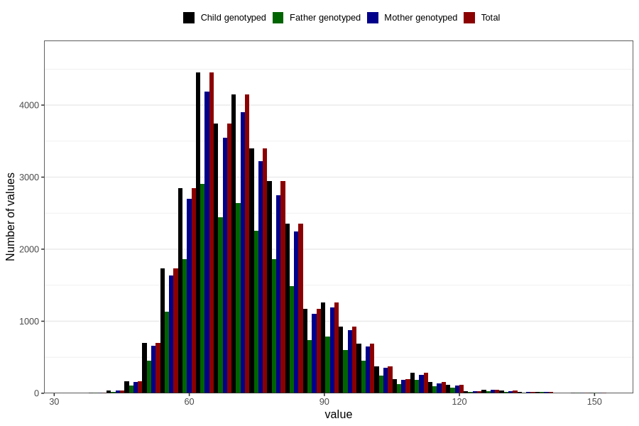

# weight_hm
Variable mapping to `HM260` in `HelseModre`.
- Number of values:

| Value | Total | Child genotyped | Mother genotyped | Father genotyped |
| ----- | ----- | --------------- | ---------------- | ---------------- |
| Missing | 48943 | 48943 | 45967 | 32578 |
| Non-missing | 31863 | 31863 | 30057 | 20585 |
| 25th percentile | 64 | 64 | 64 | 64 |
| 50th percentile | 71 | 71 | 71 | 71 |
| 75th percentile | 80 | 80 | 80 | 80 |
| Mean | 73.6886357216835 | 73.6886357216835 | 73.6553215557108 | 73.6072382803012 |
| Standard deviation | 13.8360695242297 | 13.8360695242297 | 13.7768190446969 | 13.8476868075905 |
| N | 31863 | 31863 | 30057 | 20585 |

