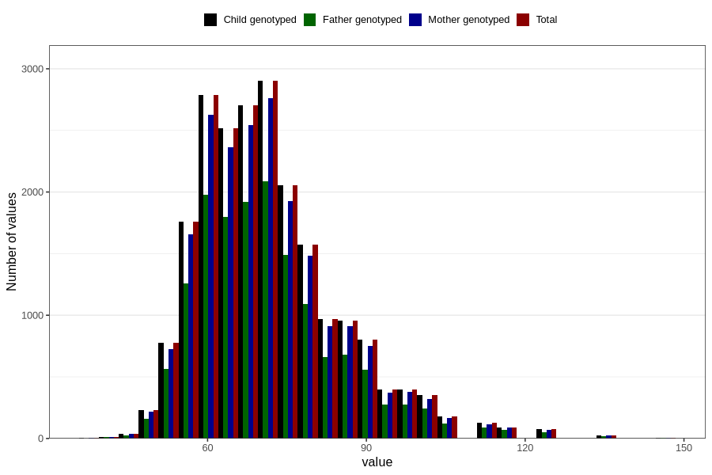

# weight_mother_14m
Variable mapping to `UM272` in `Ungdomsskjema_Mor_v12_standard`.
- Number of values:

| Value | Total | Child genotyped | Mother genotyped | Father genotyped |
| ----- | ----- | --------------- | ---------------- | ---------------- |
| Missing | 59074 | 59074 | 55560 | 37729 |
| Non-missing | 21732 | 21732 | 20464 | 15434 |
| 25th percentile | 62 | 62 | 62 | 62 |
| 50th percentile | 70 | 70 | 70 | 70 |
| 75th percentile | 79 | 79 | 79 | 78 |
| Mean | 71.6603165838395 | 71.6603165838395 | 71.6428850664582 | 71.5996501231048 |
| Standard deviation | 13.2551455822173 | 13.2551455822173 | 13.2295714618667 | 13.237340781351 |
| N | 21732 | 21732 | 20464 | 15434 |

