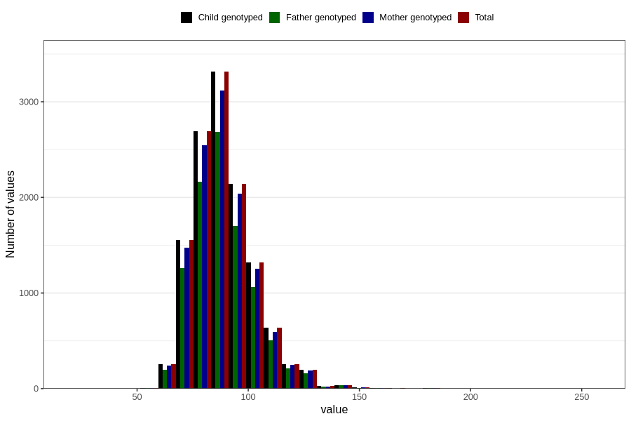

# weight_now_45f
Variable mapping to `LF34` in `MobaForeldre45_Far_v12_standard`.
- Number of values:

| Value | Total | Child genotyped | Mother genotyped | Father genotyped |
| ----- | ----- | --------------- | ---------------- | ---------------- |
| Missing | 68317 | 68317 | 64230 | 43123 |
| Non-missing | 12489 | 12489 | 11794 | 10040 |
| 25th percentile | 80 | 80 | 80 | 80 |
| 50th percentile | 87 | 87 | 87 | 87 |
| 75th percentile | 96 | 96 | 96 | 96 |
| Mean | 89.3086476098967 | 89.3086476098967 | 89.2806596574529 | 89.3023007968127 |
| Standard deviation | 13.960069938766 | 13.960069938766 | 13.8422496628489 | 13.964609177424 |
| N | 12489 | 12489 | 11794 | 10040 |

