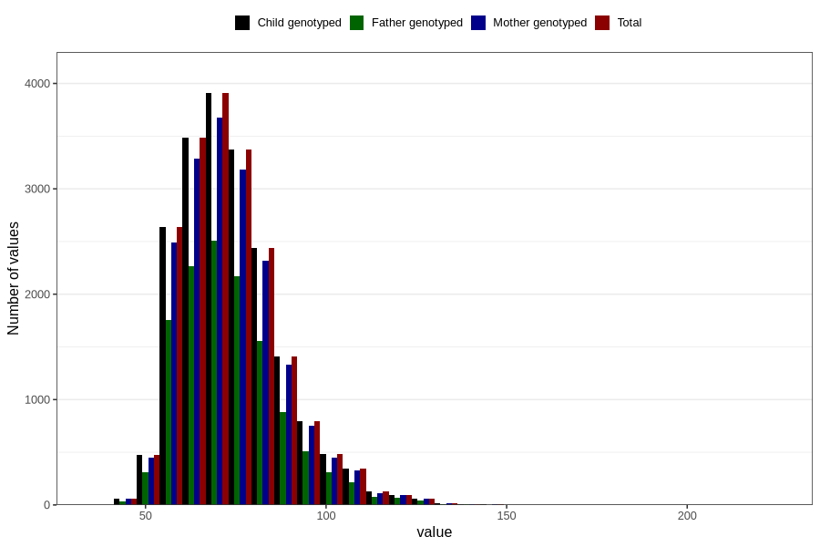

# weight_now_45m
Variable mapping to `LM29` in `MobaForeldre45_Mor_v12_standard`.
- Number of values:

| Value | Total | Child genotyped | Mother genotyped | Father genotyped |
| ----- | ----- | --------------- | ---------------- | ---------------- |
| Missing | 61077 | 61077 | 57414 | 40431 |
| Non-missing | 19729 | 19729 | 18610 | 12732 |
| 25th percentile | 64 | 64 | 64 | 64 |
| 50th percentile | 71 | 71 | 71 | 71 |
| 75th percentile | 80 | 80 | 80 | 80 |
| Mean | 73.7439910791221 | 73.7439910791221 | 73.7189575497045 | 73.6033459000943 |
| Standard deviation | 14.0660615344725 | 14.0660615344725 | 14.0091377404877 | 14.0941142897485 |
| N | 19729 | 19729 | 18610 | 12732 |

