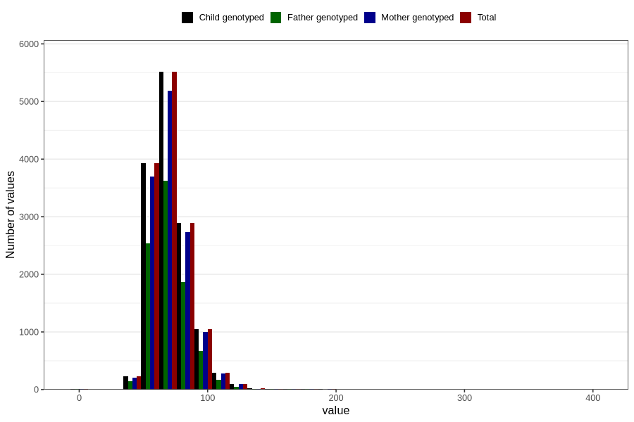

# weight_ung
Variable mapping to `UH52` in `UngHelse_standard`.
- Number of values:

| Value | Total | Child genotyped | Mother genotyped | Father genotyped |
| ----- | ----- | --------------- | ---------------- | ---------------- |
| Missing | 66743 | 66743 | 62763 | 44051 |
| Non-missing | 14063 | 14063 | 13261 | 9112 |
| 25th percentile | 60 | 60 | 60 | 61 |
| 50th percentile | 69 | 69 | 69 | 69 |
| 75th percentile | 80 | 80 | 80 | 79 |
| Mean | 71.2121169025101 | 71.2121169025101 | 71.2497549204434 | 71.016132572432 |
| Standard deviation | 15.3033244926136 | 15.3033244926136 | 15.2970309614992 | 14.8406256445495 |
| N | 14063 | 14063 | 13261 | 9112 |

