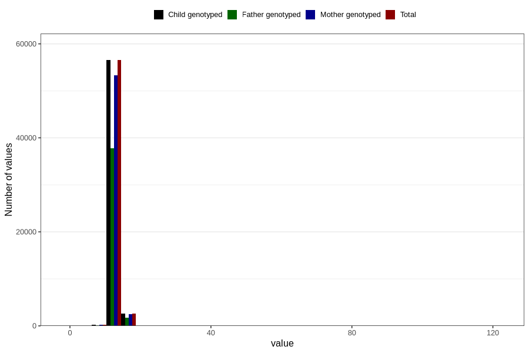

# blood_haemoglobin_highest_30w
Variable mapping to `CC126` in `Skjema3_v12`.
- Number of values:

| Value | Total | Child genotyped | Mother genotyped | Father genotyped |
| ----- | ----- | --------------- | ---------------- | ---------------- |
| Missing | 21325 | 21325 | 19888 | 13426 |
| Non-missing | 59481 | 59481 | 56136 | 39737 |
| 25th percentile | 12.3 | 12.3 | 12.3 | 12.3 |
| 50th percentile | 12.9 | 12.9 | 12.9 | 12.9 |
| 75th percentile | 13.5 | 13.5 | 13.5 | 13.5 |
| Mean | 13.0041744422589 | 13.0041744422589 | 13.0018740202366 | 13.0057578579158 |
| Standard deviation | 2.37822132610867 | 2.37822132610867 | 2.34312125292264 | 2.23128890018367 |
| N | 59481 | 59481 | 56136 | 39737 |

