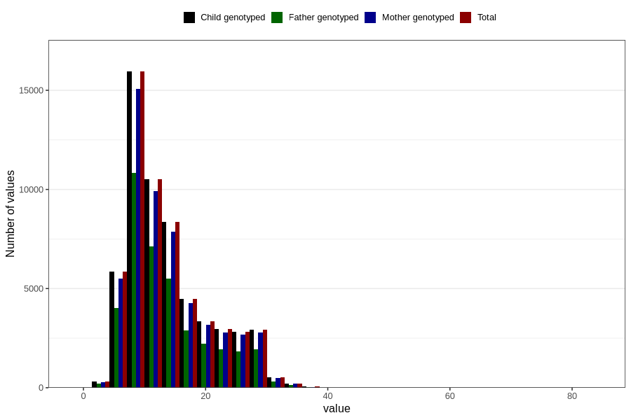

# blood_haemoglobin_highest_week_30w
Variable mapping to `CC127` in `Skjema3_v12`.
- Number of values:

| Value | Total | Child genotyped | Mother genotyped | Father genotyped |
| ----- | ----- | --------------- | ---------------- | ---------------- |
| Missing | 22430 | 22430 | 20917 | 14124 |
| Non-missing | 58376 | 58376 | 55107 | 39039 |
| 25th percentile | 9 | 9 | 9 | 9 |
| 50th percentile | 12 | 12 | 12 | 12 |
| 75th percentile | 17 | 17 | 17 | 17 |
| Mean | 13.9627072769631 | 13.9627072769631 | 13.95962400421 | 13.8351904505751 |
| Standard deviation | 6.65819366253549 | 6.65819366253549 | 6.65489386091927 | 6.60120371990931 |
| N | 58376 | 58376 | 55107 | 39039 |

