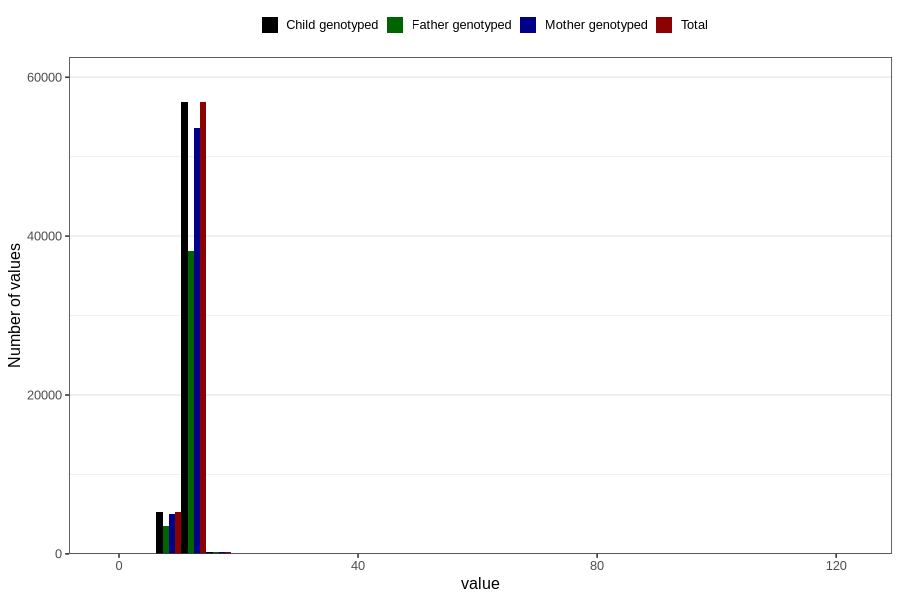

# blood_haemoglobin_last_check_30w
Variable mapping to `CC124` in `Skjema3_v12`.
- Number of values:

| Value | Total | Child genotyped | Mother genotyped | Father genotyped |
| ----- | ----- | --------------- | ---------------- | ---------------- |
| Missing | 18220 | 18220 | 17020 | 11316 |
| Non-missing | 62586 | 62586 | 59004 | 41847 |
| 25th percentile | 11.2 | 11.2 | 11.2 | 11.2 |
| 50th percentile | 11.8 | 11.8 | 11.8 | 11.9 |
| 75th percentile | 12.5 | 12.5 | 12.5 | 12.5 |
| Mean | 11.9315406001342 | 11.9315406001342 | 11.9316097213748 | 11.9331684469616 |
| Standard deviation | 2.60886817585503 | 2.60886817585503 | 2.63541036120659 | 2.37583533983396 |
| N | 62586 | 62586 | 59004 | 41847 |

