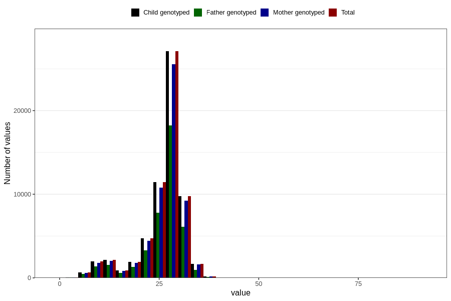

# blood_haemoglobin_last_check_week_30w
Variable mapping to `CC125` in `Skjema3_v12`.
- Number of values:

| Value | Total | Child genotyped | Mother genotyped | Father genotyped |
| ----- | ----- | --------------- | ---------------- | ---------------- |
| Missing | 18294 | 18294 | 17093 | 11334 |
| Non-missing | 62512 | 62512 | 58931 | 41829 |
| 25th percentile | 25 | 25 | 25 | 24 |
| 50th percentile | 28 | 28 | 28 | 27 |
| 75th percentile | 29 | 29 | 29 | 29 |
| Mean | 25.86876119785 | 25.86876119785 | 25.8777892789873 | 25.6907886872744 |
| Standard deviation | 5.6353143549165 | 5.6353143549165 | 5.62613992957566 | 5.69431588143724 |
| N | 62512 | 62512 | 58931 | 41829 |

