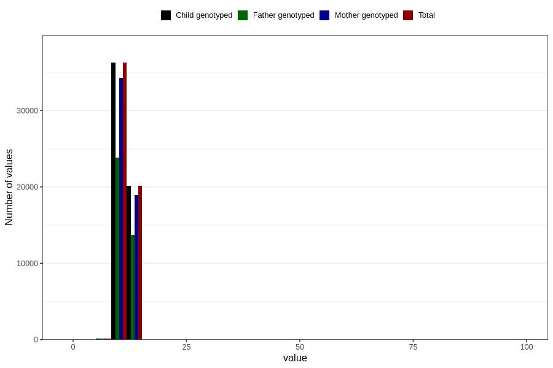

# blood_haemoglobin_lowest_30w
Variable mapping to `CC128` in `Skjema3_v12`.
- Number of values:

| Value | Total | Child genotyped | Mother genotyped | Father genotyped |
| ----- | ----- | --------------- | ---------------- | ---------------- |
| Missing | 24111 | 24111 | 22501 | 15361 |
| Non-missing | 56695 | 56695 | 53523 | 37802 |
| 25th percentile | 10.9 | 10.9 | 10.8 | 10.9 |
| 50th percentile | 11.5 | 11.5 | 11.5 | 11.5 |
| 75th percentile | 12.1 | 12.1 | 12.1 | 12.2 |
| Mean | 11.5376946820707 | 11.5376946820707 | 11.5365936139604 | 11.5439077297497 |
| Standard deviation | 2.19282380804521 | 2.19282380804521 | 2.19917897682532 | 1.92285078672689 |
| N | 56695 | 56695 | 53523 | 37802 |

