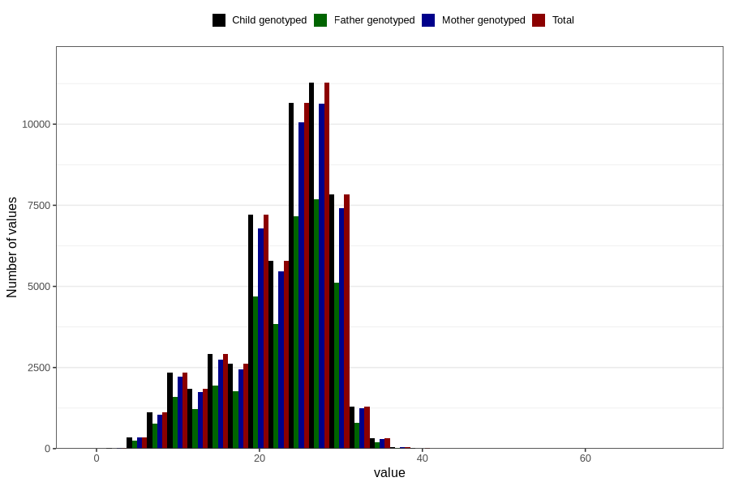

# blood_haemoglobin_lowest_week_30w
Variable mapping to `CC129` in `Skjema3_v12`.
- Number of values:

| Value | Total | Child genotyped | Mother genotyped | Father genotyped |
| ----- | ----- | --------------- | ---------------- | ---------------- |
| Missing | 25184 | 25184 | 23511 | 16066 |
| Non-missing | 55622 | 55622 | 52513 | 37097 |
| 25th percentile | 20 | 20 | 20 | 20 |
| 50th percentile | 24 | 24 | 24 | 24 |
| 75th percentile | 28 | 28 | 28 | 28 |
| Mean | 23.1354679802956 | 23.1354679802956 | 23.1391464970579 | 23.0914090088147 |
| Standard deviation | 6.17404021397273 | 6.17404021397273 | 6.17700866318178 | 6.18245915198182 |
| N | 55622 | 55622 | 52513 | 37097 |

