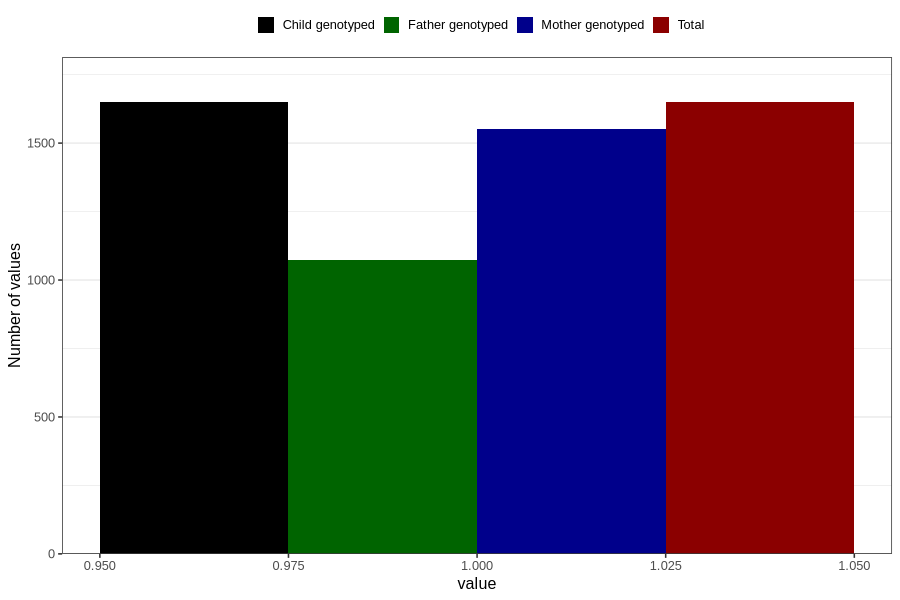

# diarrhoea_13w_16w
Variable mapping to `CC448` in `Skjema3_v12`.
- Number of values:

| Value | Total | Child genotyped | Mother genotyped | Father genotyped |
| ----- | ----- | --------------- | ---------------- | ---------------- |
| Missing | 79157 | 79157 | 74474 | 52091 |
| Non-missing | 1649 | 1649 | 1550 | 1072 |
| 1 | 1649 | 1649 | 1550 | 1072 |

