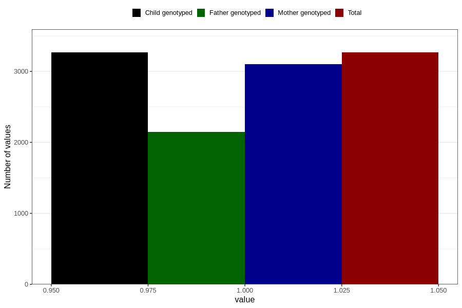

# diarrhoea_25w_28w
Variable mapping to `CC451` in `Skjema3_v12`.
- Number of values:

| Value | Total | Child genotyped | Mother genotyped | Father genotyped |
| ----- | ----- | --------------- | ---------------- | ---------------- |
| Missing | 77540 | 77540 | 72925 | 51014 |
| Non-missing | 3266 | 3266 | 3099 | 2149 |
| 1 | 3266 | 3266 | 3099 | 2149 |

