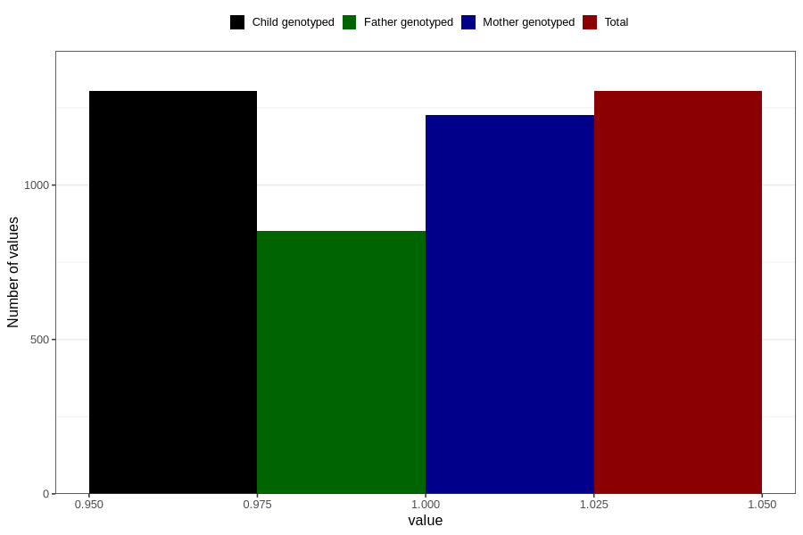

# diarrhoea_before_4w
Variable mapping to `AA276` in `Skjema1_v12`.
- Number of values:

| Value | Total | Child genotyped | Mother genotyped | Father genotyped |
| ----- | ----- | --------------- | ---------------- | ---------------- |
| Missing | 79502 | 79502 | 74798 | 52311 |
| Non-missing | 1304 | 1304 | 1226 | 852 |
| 1 | 1304 | 1304 | 1226 | 852 |

