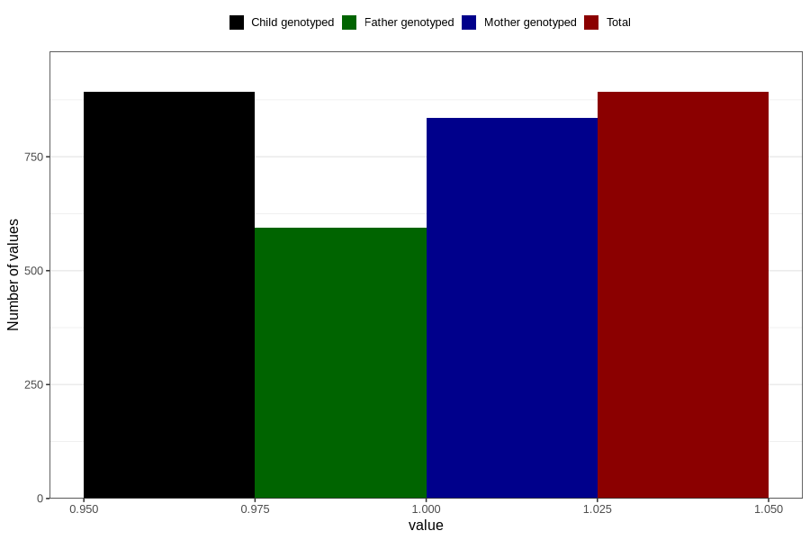

# fever_over385_5w_8w
Variable mapping to `AA337` in `Skjema1_v12`.
- Number of values:

| Value | Total | Child genotyped | Mother genotyped | Father genotyped |
| ----- | ----- | --------------- | ---------------- | ---------------- |
| Missing | 79914 | 79914 | 75189 | 52569 |
| Non-missing | 892 | 892 | 835 | 594 |
| 1 | 892 | 892 | 835 | 594 |

