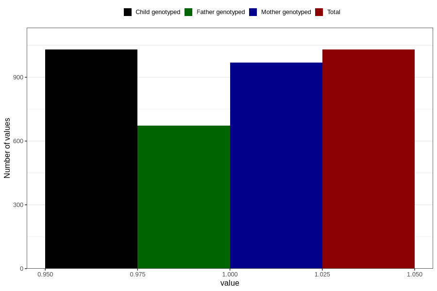

# fever_over385_9w_12w
Variable mapping to `AA338` in `Skjema1_v12`.
- Number of values:

| Value | Total | Child genotyped | Mother genotyped | Father genotyped |
| ----- | ----- | --------------- | ---------------- | ---------------- |
| Missing | 79776 | 79776 | 75055 | 52491 |
| Non-missing | 1030 | 1030 | 969 | 672 |
| 1 | 1030 | 1030 | 969 | 672 |

