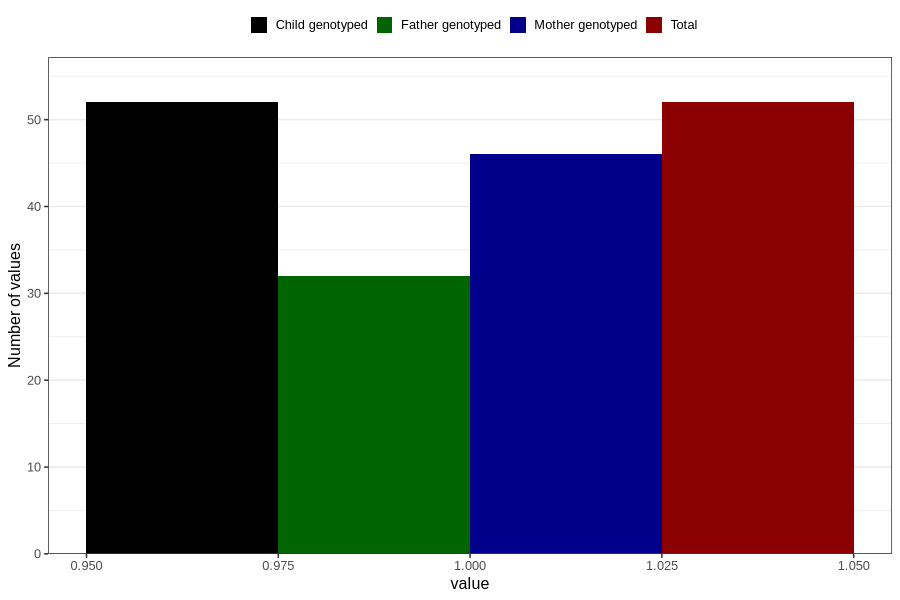

# fever_with_rash_13w_15w
Variable mapping to `AA329` in `Skjema1_v12`.
- Number of values:

| Value | Total | Child genotyped | Mother genotyped | Father genotyped |
| ----- | ----- | --------------- | ---------------- | ---------------- |
| Missing | 80754 | 80754 | 75978 | 53131 |
| Non-missing | 52 | 52 | 46 | 32 |
| 1 | 52 | 52 | 46 | 32 |

