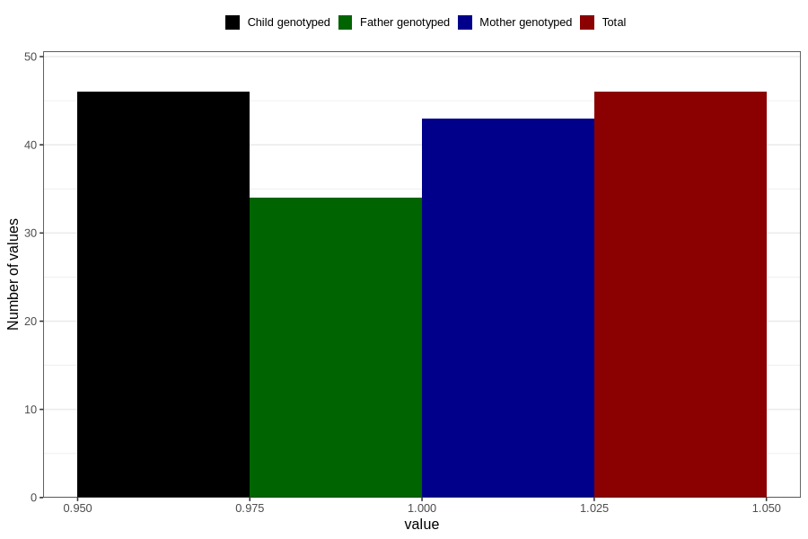

# fever_with_rash_5w_8w
Variable mapping to `AA327` in `Skjema1_v12`.
- Number of values:

| Value | Total | Child genotyped | Mother genotyped | Father genotyped |
| ----- | ----- | --------------- | ---------------- | ---------------- |
| Missing | 80760 | 80760 | 75981 | 53129 |
| Non-missing | 46 | 46 | 43 | 34 |
| 1 | 46 | 46 | 43 | 34 |

