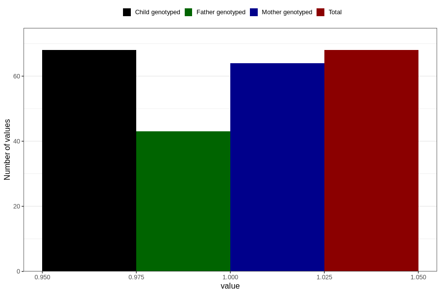

# fever_with_rash_9w_12w
Variable mapping to `AA328` in `Skjema1_v12`.
- Number of values:

| Value | Total | Child genotyped | Mother genotyped | Father genotyped |
| ----- | ----- | --------------- | ---------------- | ---------------- |
| Missing | 80738 | 80738 | 75960 | 53120 |
| Non-missing | 68 | 68 | 64 | 43 |
| 1 | 68 | 68 | 64 | 43 |

