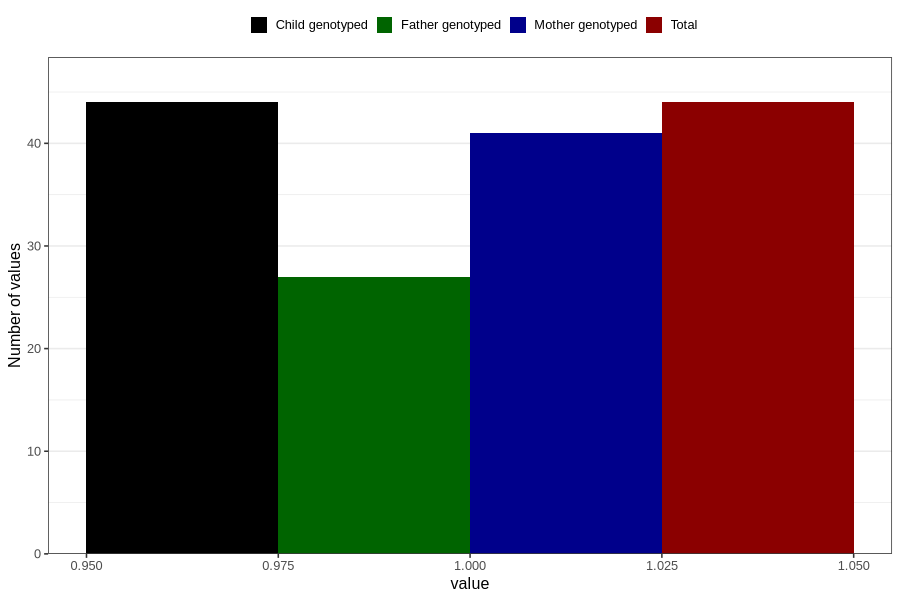

# fever_with_rash_before_4w
Variable mapping to `AA326` in `Skjema1_v12`.
- Number of values:

| Value | Total | Child genotyped | Mother genotyped | Father genotyped |
| ----- | ----- | --------------- | ---------------- | ---------------- |
| Missing | 80762 | 80762 | 75983 | 53136 |
| Non-missing | 44 | 44 | 41 | 27 |
| 1 | 44 | 44 | 41 | 27 |

