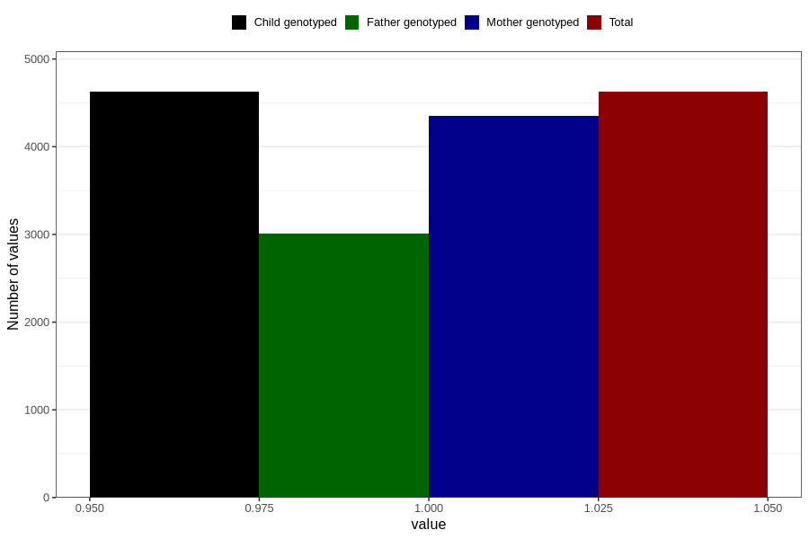

# heartburn_5w_8w
Variable mapping to `AA307` in `Skjema1_v12`.
- Number of values:

| Value | Total | Child genotyped | Mother genotyped | Father genotyped |
| ----- | ----- | --------------- | ---------------- | ---------------- |
| Missing | 76181 | 76181 | 71677 | 50153 |
| Non-missing | 4625 | 4625 | 4347 | 3010 |
| 1 | 4625 | 4625 | 4347 | 3010 |

