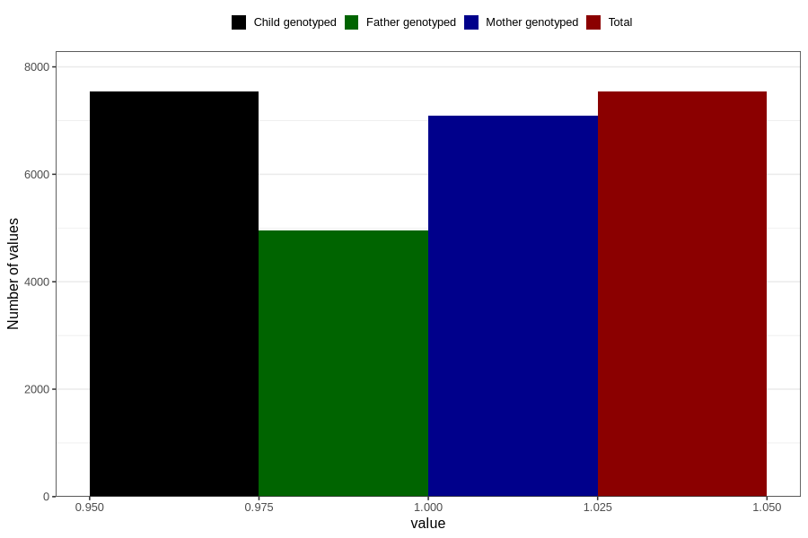

# heartburn_9w_12w
Variable mapping to `AA308` in `Skjema1_v12`.
- Number of values:

| Value | Total | Child genotyped | Mother genotyped | Father genotyped |
| ----- | ----- | --------------- | ---------------- | ---------------- |
| Missing | 73269 | 73269 | 68925 | 48210 |
| Non-missing | 7537 | 7537 | 7099 | 4953 |
| 1 | 7537 | 7537 | 7099 | 4953 |

