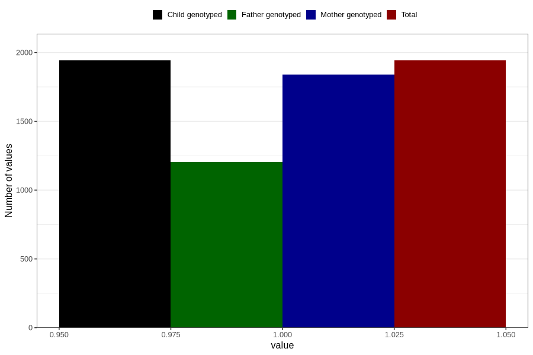

# heartburn_before_4w
Variable mapping to `AA306` in `Skjema1_v12`.
- Number of values:

| Value | Total | Child genotyped | Mother genotyped | Father genotyped |
| ----- | ----- | --------------- | ---------------- | ---------------- |
| Missing | 78864 | 78864 | 74182 | 51961 |
| Non-missing | 1942 | 1942 | 1842 | 1202 |
| 1 | 1942 | 1942 | 1842 | 1202 |

