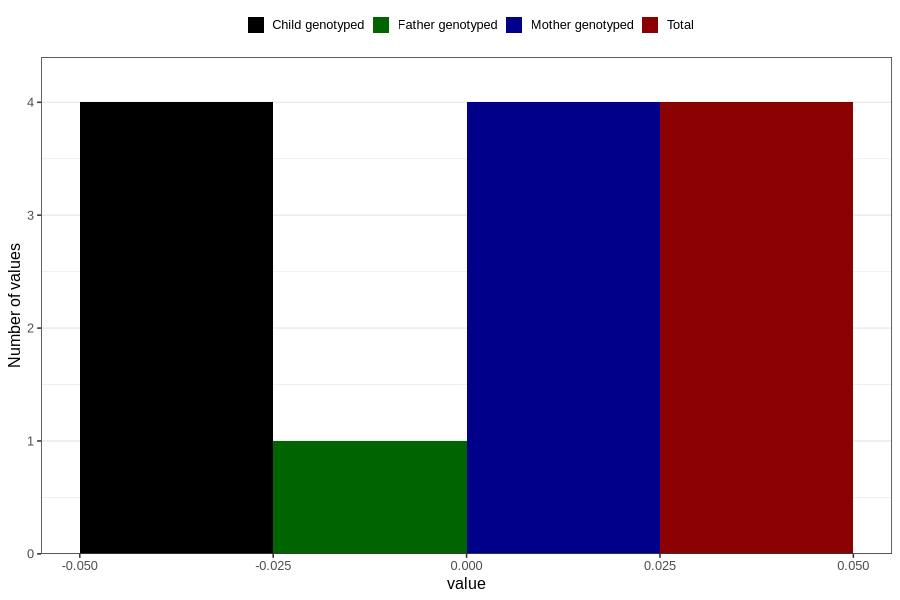

# high_blood_pressure_during_pregnancy_30w_2
Variable mapping to `CC1434` in `Skjema3_v12`.
- Number of values:

| Value | Total | Child genotyped | Mother genotyped | Father genotyped |
| ----- | ----- | --------------- | ---------------- | ---------------- |
| Missing | 77203 | 77203 | 72540 | 52013 |
| Non-missing | 3603 | 3603 | 3484 | 1150 |
| Do not know | 47 | 47 | 46 |12 |
| No | 3403 | 3403 | 3291 |1093 |
| Yes | 149 | 149 | 143 |44 |
| 0 | 4 | 4 | 4 | 1 |

