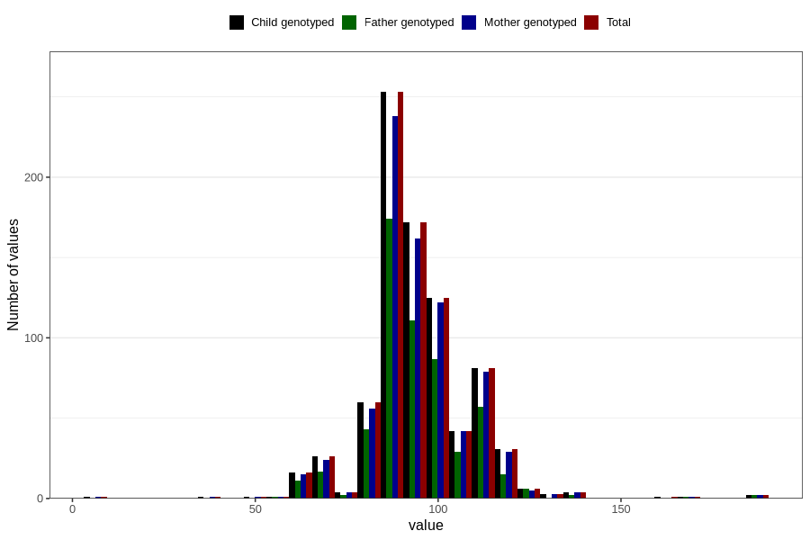

# highest_blood_pressure_before_pregnancy_diastolic
Variable mapping to `CC119` in `Skjema3_v12`.
- Number of values:

| Value | Total | Child genotyped | Mother genotyped | Father genotyped |
| ----- | ----- | --------------- | ---------------- | ---------------- |
| Missing | 79975 | 79975 | 75234 | 52605 |
| Non-missing | 831 | 831 | 790 | 558 |
| 25th percentile | 90 | 90 | 90 | 90 |
| 50th percentile | 95 | 95 | 95 | 95 |
| 75th percentile | 100 | 100 | 100 | 100 |
| Mean | 95.0108303249097 | 95.0108303249097 | 95.0544303797468 | 94.9193548387097 |
| Standard deviation | 14.0207635410339 | 14.0207635410339 | 13.9001809716256 | 13.5247210962752 |
| N | 831 | 831 | 790 | 558 |

