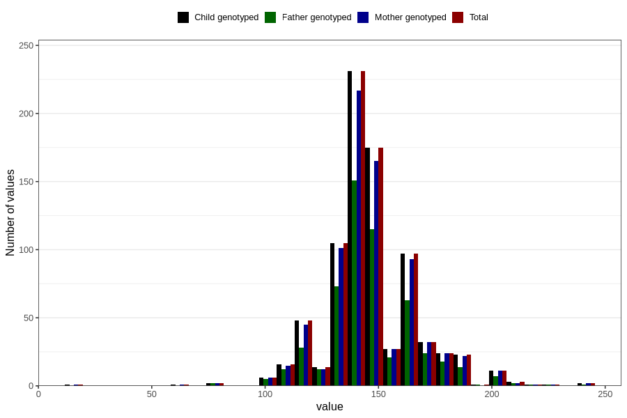

# highest_blood_pressure_before_pregnancy_systolic
Variable mapping to `CC118` in `Skjema3_v12`.
- Number of values:

| Value | Total | Child genotyped | Mother genotyped | Father genotyped |
| ----- | ----- | --------------- | ---------------- | ---------------- |
| Missing | 79985 | 79985 | 75244 | 52612 |
| Non-missing | 821 | 821 | 780 | 551 |
| 25th percentile | 140 | 140 | 140 | 139.5 |
| 50th percentile | 140 | 140 | 140 | 140 |
| 75th percentile | 155 | 155 | 155 | 155 |
| Mean | 146.075517661389 | 146.075517661389 | 146.183333333333 | 146.341197822142 |
| Standard deviation | 19.9962593424124 | 19.9962593424124 | 20.0415737140635 | 19.5571821175954 |
| N | 821 | 821 | 780 | 551 |

