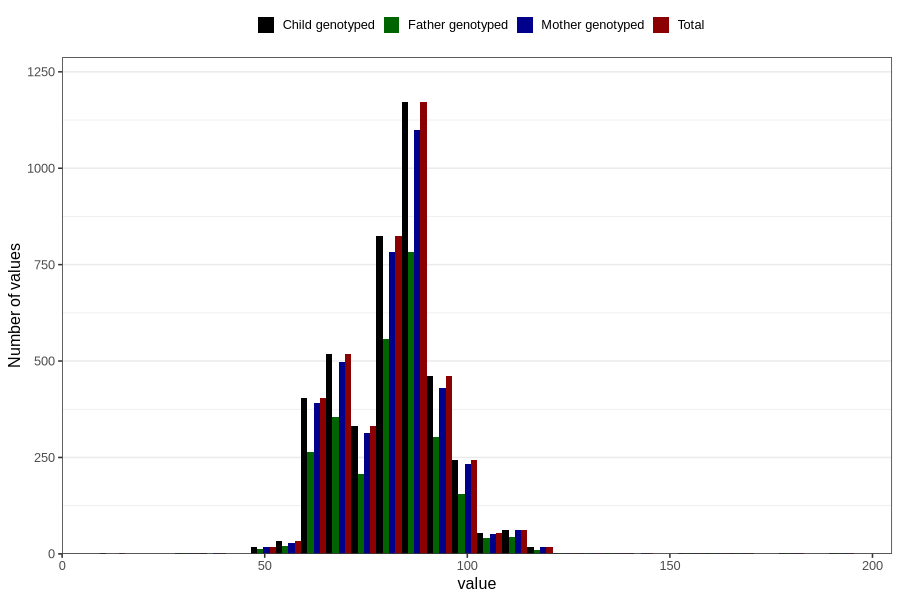

# highest_blood_pressure_during_pregnancy_30w_diastolic
Variable mapping to `CC115` in `Skjema3_v12`.
- Number of values:

| Value | Total | Child genotyped | Mother genotyped | Father genotyped |
| ----- | ----- | --------------- | ---------------- | ---------------- |
| Missing | 76648 | 76648 | 72085 | 50395 |
| Non-missing | 4158 | 4158 | 3939 | 2768 |
| 25th percentile | 74 | 74 | 74 | 74 |
| 50th percentile | 82 | 82 | 82 | 82 |
| 75th percentile | 90 | 90 | 90 | 90 |
| Mean | 82.3383838383838 | 82.3383838383838 | 82.3264788017263 | 82.3916184971098 |
| Standard deviation | 12.9485287173503 | 12.9485287173503 | 12.9844825568021 | 12.9620318687284 |
| N | 4158 | 4158 | 3939 | 2768 |

