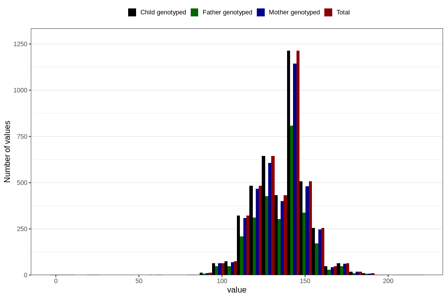

# highest_blood_pressure_during_pregnancy_30w_systolic
Variable mapping to `CC114` in `Skjema3_v12`.
- Number of values:

| Value | Total | Child genotyped | Mother genotyped | Father genotyped |
| ----- | ----- | --------------- | ---------------- | ---------------- |
| Missing | 76642 | 76642 | 72080 | 50390 |
| Non-missing | 4164 | 4164 | 3944 | 2773 |
| 25th percentile | 125 | 125 | 125 | 125 |
| 50th percentile | 140 | 140 | 140 | 140 |
| 75th percentile | 145 | 145 | 145 | 145 |
| Mean | 135.787463976945 | 135.787463976945 | 135.727687626775 | 135.877028489001 |
| Standard deviation | 16.1859161979138 | 16.1859161979138 | 16.2360030552327 | 16.3059788023378 |
| N | 4164 | 4164 | 3944 | 2773 |

