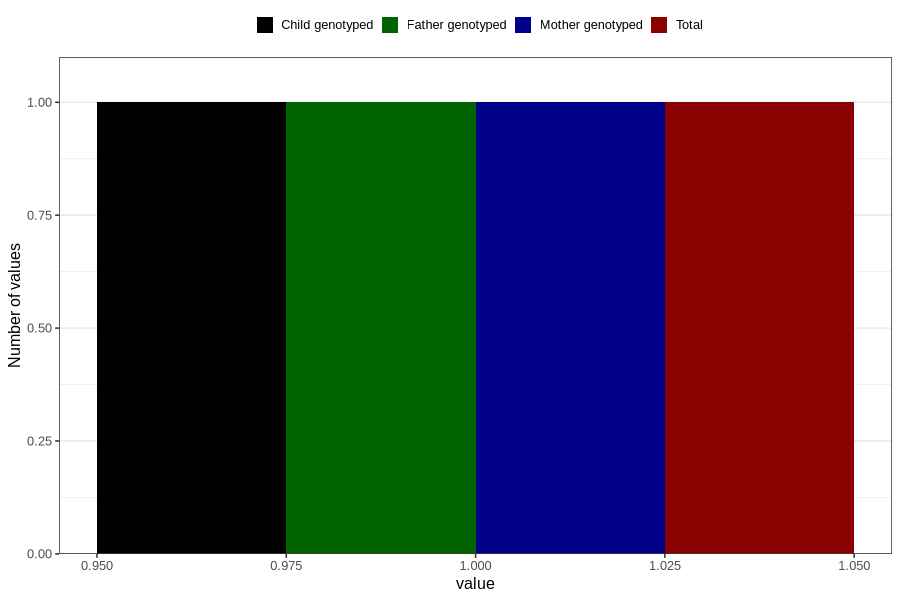

# hospitalized_amniotic_fluid_leakage_0_4w
Variable mapping to `CC156` in `Skjema3_v12`.
- Number of values:

| Value | Total | Child genotyped | Mother genotyped | Father genotyped |
| ----- | ----- | --------------- | ---------------- | ---------------- |
| Missing | 80805 | 80805 | 76023 | 53162 |
| Non-missing | 1 | 1 | 1 | 1 |
| 1 | 1 | 1 | 1 | 1 |

