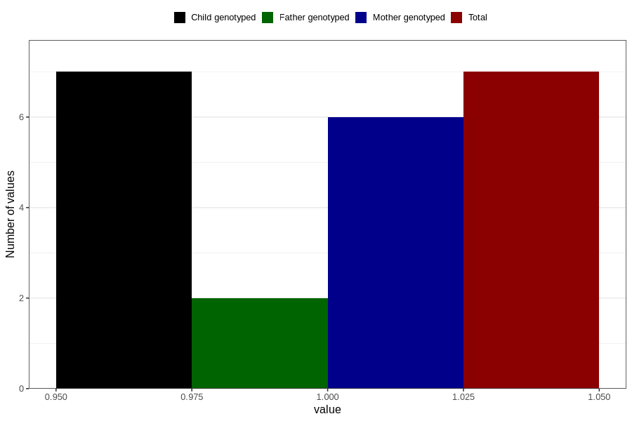

# hospitalized_amniotic_fluid_leakage_21_24w
Variable mapping to `CC161` in `Skjema3_v12`.
- Number of values:

| Value | Total | Child genotyped | Mother genotyped | Father genotyped |
| ----- | ----- | --------------- | ---------------- | ---------------- |
| Missing | 80799 | 80799 | 76018 | 53161 |
| Non-missing | 7 | 7 | 6 | 2 |
| 1 | 7 | 7 | 6 | 2 |

