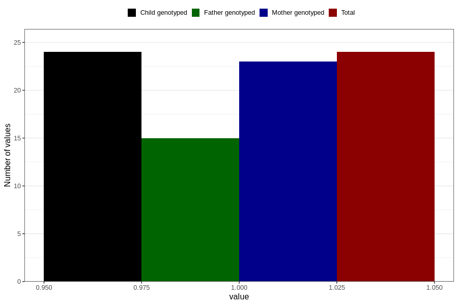

# hospitalized_amniotic_fluid_leakage_after_29w
Variable mapping to `CC163` in `Skjema3_v12`.
- Number of values:

| Value | Total | Child genotyped | Mother genotyped | Father genotyped |
| ----- | ----- | --------------- | ---------------- | ---------------- |
| Missing | 80782 | 80782 | 76001 | 53148 |
| Non-missing | 24 | 24 | 23 | 15 |
| 1 | 24 | 24 | 23 | 15 |

