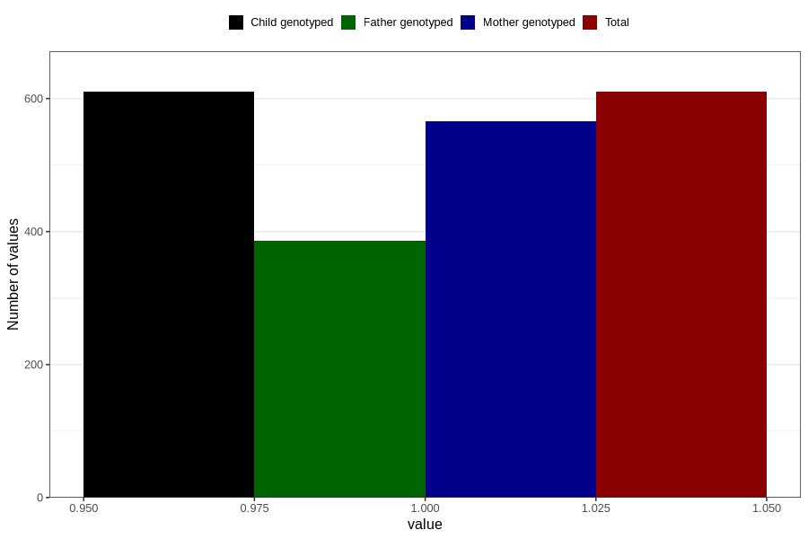

# hospitalized_bleeding
Variable mapping to `CC146` in `Skjema3_v12`.
- Number of values:

| Value | Total | Child genotyped | Mother genotyped | Father genotyped |
| ----- | ----- | --------------- | ---------------- | ---------------- |
| Missing | 80196 | 80196 | 75458 | 52777 |
| Non-missing | 610 | 610 | 566 | 386 |
| 1 | 610 | 610 | 566 | 386 |

