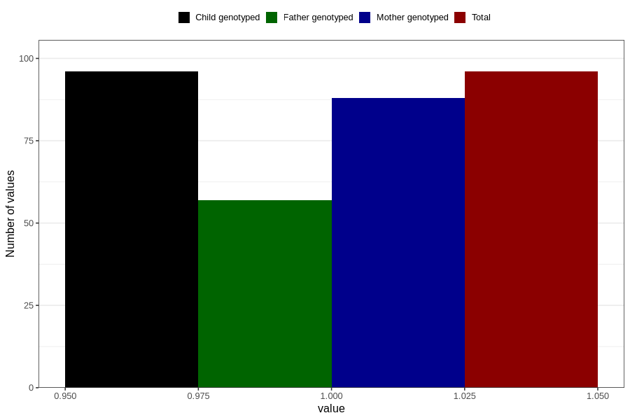

# hospitalized_bleeding_13_16w
Variable mapping to `CC150` in `Skjema3_v12`.
- Number of values:

| Value | Total | Child genotyped | Mother genotyped | Father genotyped |
| ----- | ----- | --------------- | ---------------- | ---------------- |
| Missing | 80710 | 80710 | 75936 | 53106 |
| Non-missing | 96 | 96 | 88 | 57 |
| 1 | 96 | 96 | 88 | 57 |

