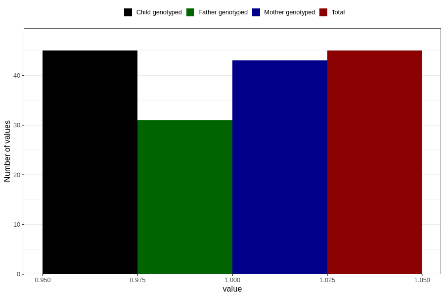

# hospitalized_bleeding_5_8w
Variable mapping to `CC148` in `Skjema3_v12`.
- Number of values:

| Value | Total | Child genotyped | Mother genotyped | Father genotyped |
| ----- | ----- | --------------- | ---------------- | ---------------- |
| Missing | 80761 | 80761 | 75981 | 53132 |
| Non-missing | 45 | 45 | 43 | 31 |
| 1 | 45 | 45 | 43 | 31 |

