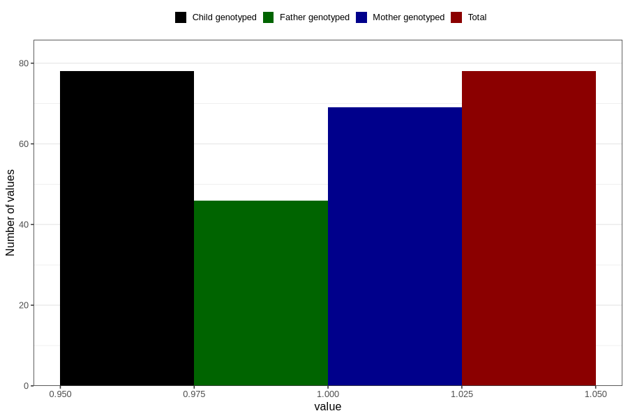

# hospitalized_bleeding_9_12w
Variable mapping to `CC149` in `Skjema3_v12`.
- Number of values:

| Value | Total | Child genotyped | Mother genotyped | Father genotyped |
| ----- | ----- | --------------- | ---------------- | ---------------- |
| Missing | 80728 | 80728 | 75955 | 53117 |
| Non-missing | 78 | 78 | 69 | 46 |
| 1 | 78 | 78 | 69 | 46 |

