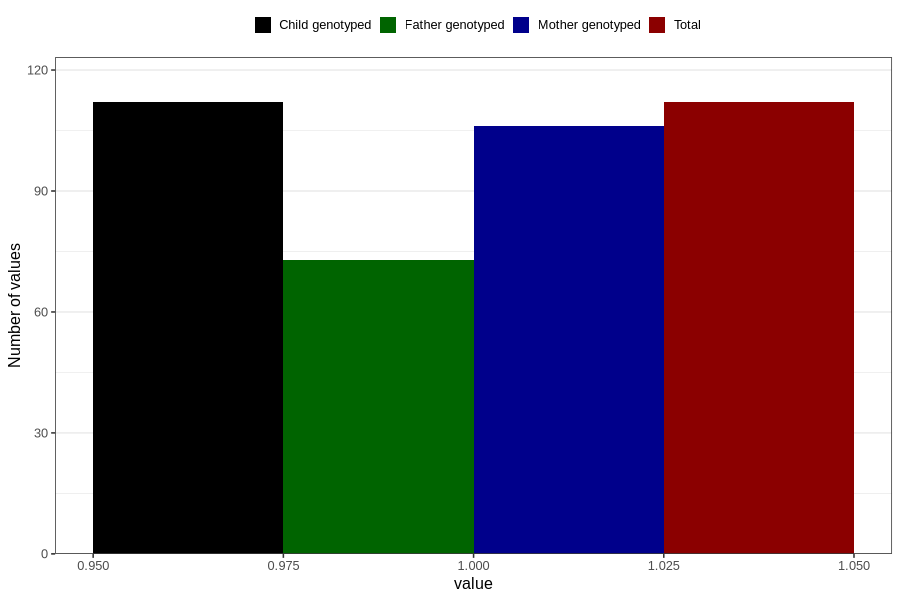

# hospitalized_bleeding_after_29w
Variable mapping to `CC154` in `Skjema3_v12`.
- Number of values:

| Value | Total | Child genotyped | Mother genotyped | Father genotyped |
| ----- | ----- | --------------- | ---------------- | ---------------- |
| Missing | 80694 | 80694 | 75918 | 53090 |
| Non-missing | 112 | 112 | 106 | 73 |
| 1 | 112 | 112 | 106 | 73 |

